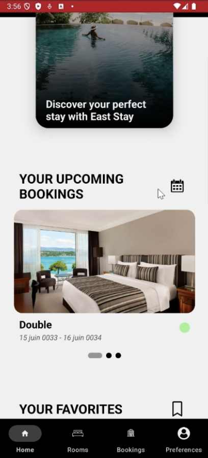
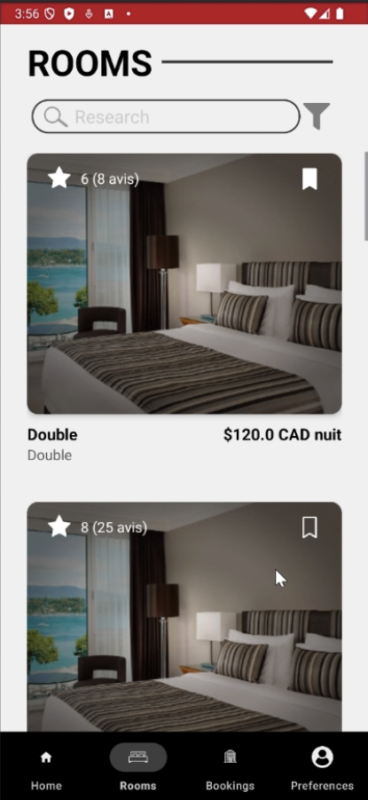
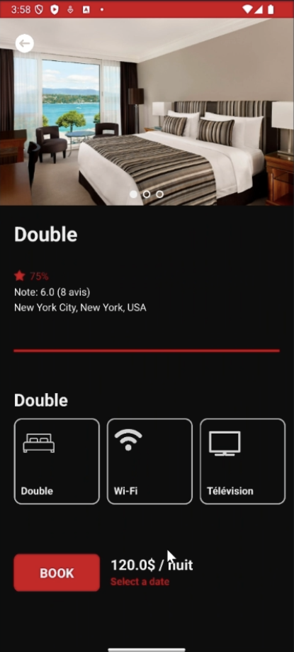
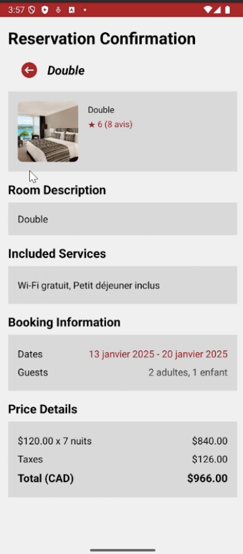
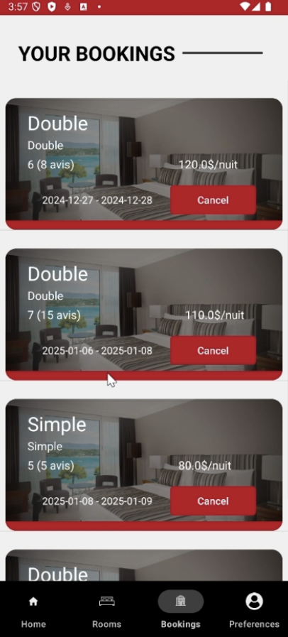

# EasyStay App Mobile

EasyStay is an Android Studio Kotlin mobile application that allows users to book rooms from a hotel. The app fetches data from our own API and supports internationalization, light and dark modes, and profile modification.

## Preview

Here are some preview images of the app:







## Features

- Book rooms from a hotel
- Fetch data from our own API
- Internationalization support
- Light and dark mode
- Modify user profile

## Setup

To set up the project, follow these steps:

1. Clone the repository:
    ```bash
    git clone https://github.com/yourusername/easystay-app-mobile.git
    ```
2. Open the project in Android Studio.
3. Sync the project with Gradle files.
4. Run the app on an emulator or a physical device.

## Requirements

- Android Studio
- Kotlin 1.5+
- Android SDK 21+

## Contributing

If you would like to contribute to the project, please fork the repository and submit a pull request.

## License

This project is licensed under the MIT License.
